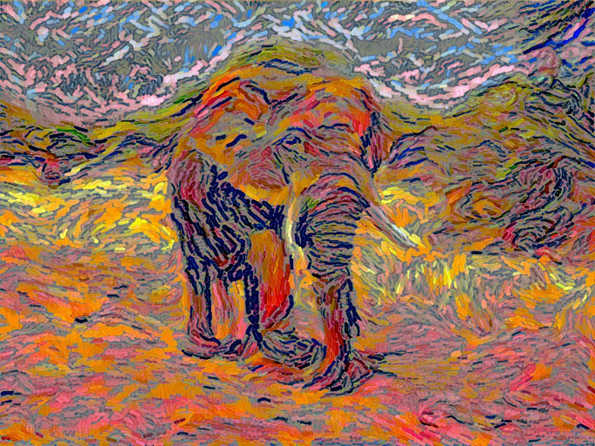
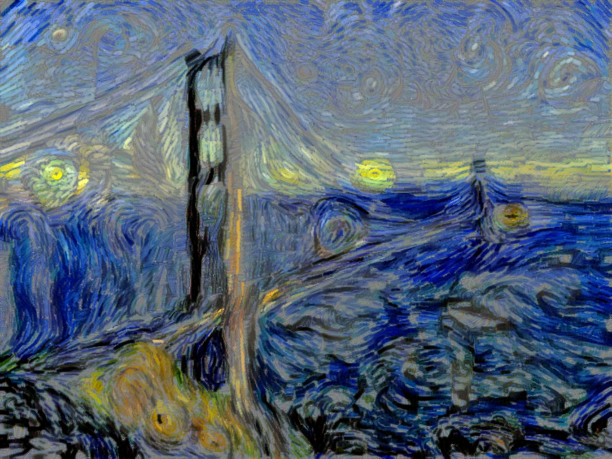
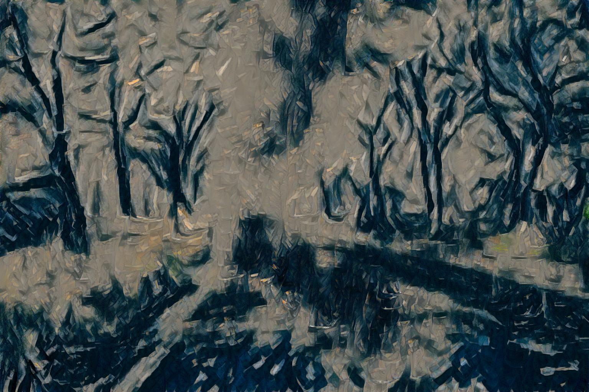

# Parametrized-brushstroke Image Style Transfer

This is a Pytorch implementation of the paper 
["Rethinking Style Transfer: From Pixels to Parameterized Brushstrokes"](http://arxiv.org/abs/2103.17185).

<p align='center'>
  
  
  
</p>

## Prerequisites

[Pytorch cluster](https://github.com/rusty1s/pytorch_cluster)

[Neural monitor](https://github.com/justanhduc/neuralnet-pytorch) (For logging)

[VGG pretrained weight file](https://github.com/ftokarev/tf-vgg-weights/raw/master/vgg19_weights_normalized.h5) 
(Put it in `vgg_weights` folder in root)

## Running the code

```
python main.py /path/to/content/image /path/to/style/image
```

Type `python main.py` to see all available options.

## Similarities/differences to the official implementation

Similarities
- The renderer and the initialization schemes are no-brainer adaptations from the 
official repo.
- The training schemes (including learning rates and optimizers) are the same.
- The visual results look largely similar.

Differences
- Some minor details regarding the style losses are different.

## References

[Official Tensorflow implementation](https://github.com/CompVis/brushstroke-parameterized-style-transfer)
